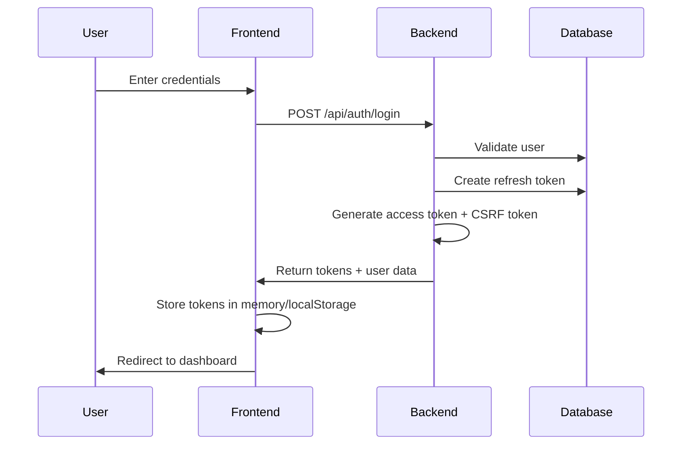
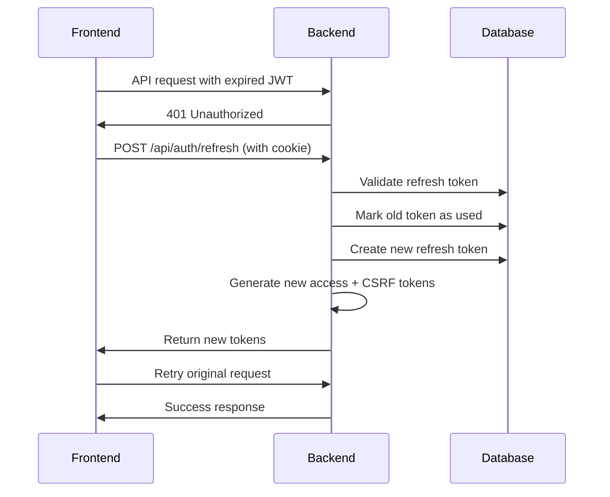
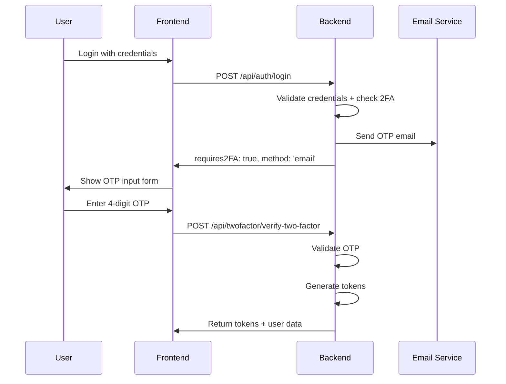
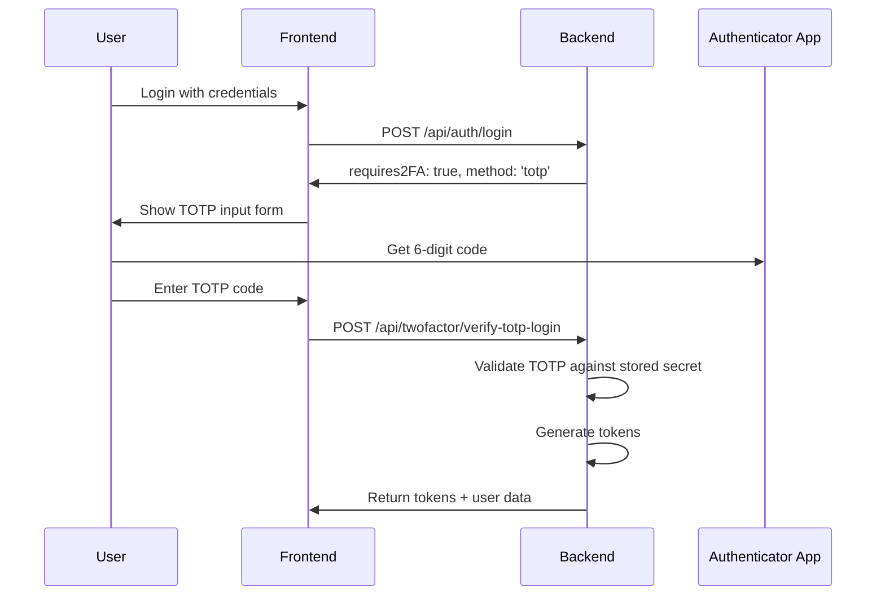
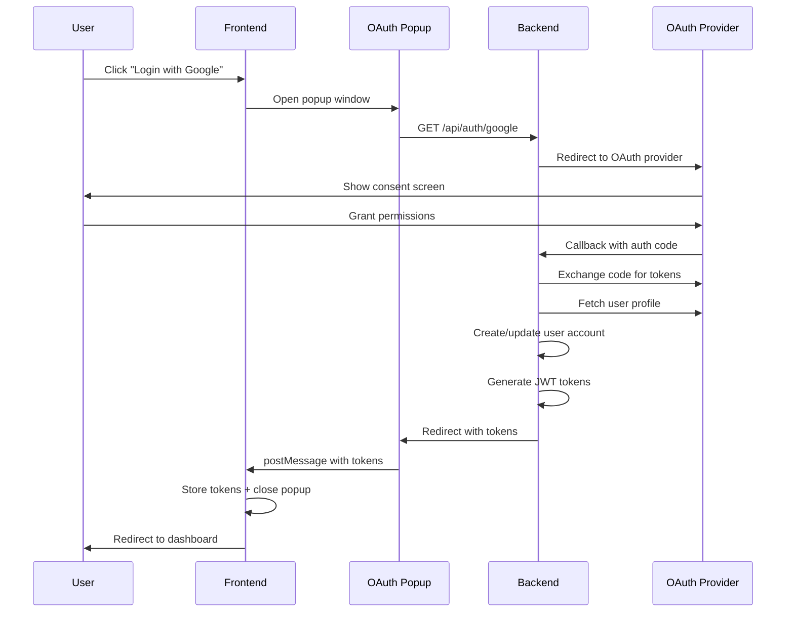

# 🔐 Authentication and Tokens Architecture Documentation

## Table of Contents
1. [Architecture Overview](#architecture-overview)
2. [Core Components](#core-components)
3. [Token System](#token-system)
4. [Security Features](#security-features)
5. [Authentication Flows](#authentication-flows)
6. [Session Management](#session-management)
7. [API Endpoints](#api-endpoints)
8. [Frontend Integration](#frontend-integration)
9. [Security Monitoring](#security-monitoring)
10. [Database Schema](#database-schema)
11. [Rate Limiting](#rate-limiting)
12. [Best Practices](#best-practices)

---

## Architecture Overview

The MongoSnap application implements a **multi-layered authentication system** with enterprise-grade security features:

### 🏗️ **High-Level Architecture**
```
┌─────────────────┐    ┌──────────────────┐    ┌─────────────────┐
│   Frontend      │    │    Backend       │    │    Database     │
│   (React)       │◄──►│   (Express.js)   │◄──►│   (MongoDB)     │
│                 │    │                  │    │                 │
│ • UserContext   │    │ • JWT Tokens     │    │ • Users         │
│ • CSRF Handling │    │ • CSRF Protection│    │ • RefreshTokens │
│ • Session Mgmt  │    │ • Rate Limiting  │    │ • Session Data  │
│ • OAuth Popups  │    │ • 2FA Systems    │    │ • Analytics     │
└─────────────────┘    └──────────────────┘    └─────────────────┘
```

### 🔑 **Core Security Principles**
- **Zero Trust**: Every request must be authenticated and authorized
- **Defense in Depth**: Multiple security layers (JWT + CSRF + Rate Limiting)
- **Token Rotation**: Automatic refresh token rotation to prevent replay attacks
- **Device Tracking**: Comprehensive device fingerprinting and monitoring
- **Session Analytics**: Real-time security monitoring and risk assessment

---

## Core Components

### 1. **User Model** (`apps/backend/models/User.js`)
```javascript
// Core user fields with authentication enhancements
{
  name: String,
  email: String (unique),
  password: String (hashed with bcrypt),
  isVerified: Boolean,
  
  // OAuth Integration
  oauthProvider: String, // 'google', 'github', etc.
  oauthId: String,
  
  // Two-Factor Authentication
  twoFactorEnabled: Boolean,
  twoFactormethod: String, // 'email' or 'totp'
  twoFactorSecret: String, // TOTP secret
  twoFactorToken: String, // Temporary email OTP
  twoFactorExpiresAt: Date,
  backupCodes: [{ code: String, used: Boolean, usedAt: Date }],
  
  // CSRF Protection
  csrfToken: String,
  csrfTokenExpiresAt: Date,
  
  // Session Tracking
  refreshTokenFamily: String,
  lastActiveTokenFamily: String,
  loginNotificationsEnabled: Boolean
}
```

### 2. **RefreshToken Model** (`apps/backend/models/RefreshToken.js`)
```javascript
// Advanced refresh token with security metadata
{
  token: String (unique, indexed),
  userId: ObjectId (ref: 'User'),
  family: String, // Token family for rotation tracking
  
  // Token States
  isUsed: Boolean,
  isRevoked: Boolean,
  expiresAt: Date,
  createdAt: Date,
  lastUsedAt: Date,
  
  // Device Security
  deviceInfo: {
    userAgent: String,
    ipAddress: String,
    deviceFingerprint: String // SHA256 hash of UA + IP
  },
  
  // Security Tracking
  revokedBy: String, // 'user', 'admin', 'security_breach', etc.
  revokedAt: Date,
  successorToken: String // Links to next token in rotation chain
}
```

---

## Token System

### 🎯 **Three-Token Architecture**

#### 1. **Access Tokens (JWT)**
- **Purpose**: API request authorization
- **Lifetime**: 15 minutes
- **Storage**: Frontend memory/localStorage
- **Payload**: `{ id: userId, iat, exp }`
- **Security**: Short-lived, stateless

#### 2. **Refresh Tokens (Database-Stored)**
- **Purpose**: Generate new access tokens
- **Lifetime**: 7 days
- **Storage**: HTTP-only cookie + MongoDB
- **Features**:
  - Token families for rotation tracking
  - Device fingerprinting
  - Automatic rotation on use
  - Comprehensive security metadata

#### 3. **CSRF Tokens**
- **Purpose**: Protect state-changing operations
- **Lifetime**: 24 hours
- **Storage**: Frontend localStorage
- **Usage**: Included in POST/PUT/DELETE request headers

### 🔄 **Token Generation Flow**
```javascript
// apps/backend/utils/tokengeneration.js

// 1. Generate Access Token (15 min)
function generateAccessToken(user) {
    return jwt.sign({ id: user._id }, JWT_SECRET, { expiresIn: '15m' });
}

// 2. Create Database-Stored Refresh Token (7 days)
async function createAndStoreRefreshToken(user, req, family = null) {
    const family = family || RefreshToken.createTokenFamily();
    const refreshToken = generateRefreshToken(user);
    const deviceInfo = extractDeviceInfo(req);
    
    const refreshTokenDoc = new RefreshToken({
        token: refreshToken,
        userId: user._id,
        family: family,
        expiresAt: new Date(Date.now() + 7 * 24 * 60 * 60 * 1000),
        deviceInfo: deviceInfo
    });
    
    await refreshTokenDoc.save();
    return { token: refreshToken, family };
}

// 3. Generate CSRF Token (24 hours)
userSchema.methods.generateCSRFToken = function() {
    const token = crypto.randomBytes(32).toString('hex');
    this.csrfToken = token;
    this.csrfTokenExpiresAt = new Date(Date.now() + 24 * 60 * 60 * 1000);
    return token;
};
```

---

## Security Features

### 🛡️ **Token Rotation & Reuse Detection**
```javascript
// apps/backend/utils/tokengeneration.js
async function validateAndRotateRefreshToken(token, req) {
    const refreshTokenDoc = await RefreshToken.findOne({ token, userId });
    
    // Security Check: Token Reuse Detection
    if (refreshTokenDoc.isUsed) {
        // CRITICAL: Revoke entire token family
        await RefreshToken.revokeFamily(refreshTokenDoc.family, 'token_reuse');
        throw new Error('Token reuse detected - security breach');
    }
    
    // Mark current token as used
    refreshTokenDoc.isUsed = true;
    refreshTokenDoc.lastUsedAt = new Date();
    await refreshTokenDoc.save();
    
    // Generate new token in same family
    const newTokenData = await createAndStoreRefreshToken(user, req, refreshTokenDoc.family);
    refreshTokenDoc.successorToken = newTokenData.token;
    await refreshTokenDoc.save();
    
    return { user, accessToken, refreshToken: newTokenData.token };
}
```

### 🔐 **CSRF Protection System**
```javascript
// apps/backend/routes/middleware.js
async function validateCSRFToken(req, res, next) {
    // Skip for GET, HEAD, OPTIONS
    if (['GET', 'HEAD', 'OPTIONS'].includes(req.method)) {
        return next();
    }
    
    const csrfToken = req.headers['x-csrf-token'];
    if (!csrfToken) {
        return res.status(403).json({ 
            message: 'CSRF token missing',
            code: 'CSRF_TOKEN_MISSING'
        });
    }
    
    const user = await User.findById(req.userId);
    if (!user.validateCSRFToken(csrfToken)) {
        return res.status(403).json({ 
            message: 'Invalid or expired CSRF token',
            code: 'CSRF_TOKEN_INVALID'
        });
    }
    
    next();
}
```

### 📱 **Device Fingerprinting**
```javascript
// apps/backend/utils/tokengeneration.js
function extractDeviceInfo(req) {
    const userAgent = req.get('User-Agent') || 'Unknown Device';
    const ipAddress = req.ip || 'Unknown IP';
    
    // Create unique device fingerprint
    const deviceFingerprint = crypto.createHash('sha256')
        .update(userAgent + ipAddress)
        .digest('hex');

    return { userAgent, ipAddress, deviceFingerprint };
}
```

---

## Authentication Flows

### 🚀 **1. Standard Login Flow**


### 🔄 **2. Token Refresh Flow**


### 🛡️ **3. Two-Factor Authentication Flow**

#### **Email OTP Flow**


#### **TOTP Flow**


### 🌐 **4. OAuth Flow (Google/GitHub)**


---

## Session Management

### 📊 **Active Sessions Overview**
```javascript
// GET /api/auth/active-sessions
{
  "sessions": [
    {
      "id": "session_id",
      "family": "token_family_id",
      "createdAt": "2024-01-15T10:00:00Z",
      "lastUsedAt": "2024-01-15T14:30:00Z",
      "expiresAt": "2024-01-22T10:00:00Z",
      "deviceInfo": {
        "userAgent": "Chrome 120.0 on Windows",
        "ipAddress": "192.168.1.100",
        "deviceFingerprint": "a1b2c3d4..."
      },
      "isCurrent": true,
      "isUsed": false,
      "securityInfo": {
        "hasSuccessor": false,
        "revokedBy": null,
        "revokedAt": null
      }
    }
  ],
  "currentSessionId": "session_id"
}
```

### 🎯 **Session Operations**

#### **Revoke Specific Session**
```javascript
// POST /api/auth/revoke-session
{
  "sessionId": "specific_session_id"
}
// Marks specific refresh token as revoked
```

#### **Revoke All Sessions (Logout All Devices)**
```javascript
// POST /api/auth/revoke-all-sessions
// Revokes all refresh tokens for the user
// Forces re-authentication on all devices
```

---

## API Endpoints

### 🔐 **Authentication Endpoints**

| Method | Endpoint | Purpose | Auth Required | CSRF Required |
|--------|----------|---------|---------------|---------------|
| `POST` | `/api/auth/signup` | User registration | ❌ | ❌ |
| `POST` | `/api/auth/login` | User login | ❌ | ❌ |
| `POST` | `/api/auth/refresh` | Refresh access token | ❌ | ❌ |
| `POST` | `/api/auth/logout` | Logout user | ❌ | ❌ |
| `GET` | `/api/auth/me` | Get current user | ✅ | ❌ |
| `GET` | `/api/auth/csrf-token` | Generate CSRF token | ✅ | ❌ |
| `GET` | `/api/auth/active-sessions` | List user sessions | ✅ | ❌ |
| `POST` | `/api/auth/revoke-session` | Revoke specific session | ✅ | ✅ |
| `POST` | `/api/auth/revoke-all-sessions` | Revoke all sessions | ✅ | ✅ |
| `POST` | `/api/auth/request-password-change` | Request password change | ✅ | ✅ |

### 🛡️ **Two-Factor Authentication Endpoints**

| Method | Endpoint | Purpose | Auth Required | CSRF Required |
|--------|----------|---------|---------------|---------------|
| `GET` | `/api/twofactor/status` | Get 2FA status | ✅ | ❌ |
| `POST` | `/api/twofactor/enable-email-two-factor` | Enable email 2FA | ✅ | ✅ |
| `POST` | `/api/twofactor/disable-email-two-factor` | Disable email 2FA | ✅ | ✅ |
| `POST` | `/api/twofactor/verify-two-factor` | Verify email OTP | ❌ | ❌ |
| `POST` | `/api/twofactor/resend-two-factor` | Resend email OTP | ❌ | ❌ |
| `POST` | `/api/twofactor/enable-totp-verification` | Setup TOTP 2FA | ✅ | ✅ |
| `POST` | `/api/twofactor/verify-totp-verification` | Verify TOTP setup | ✅ | ❌ |
| `POST` | `/api/twofactor/verify-totp-login` | Login with TOTP | ❌ | ❌ |
| `POST` | `/api/twofactor/regenerate-backup-codes` | Generate new backup codes | ✅ | ✅ |

### 🌐 **OAuth Endpoints**

| Method | Endpoint | Purpose |
|--------|----------|---------|
| `GET` | `/api/auth/google` | Initiate Google OAuth |
| `GET` | `/api/auth/google/callback` | Handle Google callback |
| `GET` | `/api/auth/github` | Initiate GitHub OAuth |
| `GET` | `/api/auth/github/callback` | Handle GitHub callback |

### 📊 **Analytics & Security Endpoints**

| Method | Endpoint | Purpose | Auth Required |
|--------|----------|---------|---------------|
| `GET` | `/api/auth/session-analytics` | Get session analytics | ✅ |
| `GET` | `/api/auth/security-monitor` | Get security monitoring data | ✅ |

---

## Frontend Integration

### 🎛️ **UserContext Provider** (`apps/frontend/src/contexts/UserContext.jsx`)
```javascript
const UserProvider = ({ children }) => {
    const [user, setUser] = useState(null);
    const [csrfToken, setCsrfToken] = useState(null);
    
    // Enhanced fetchWithAuth with automatic token refresh
    const fetchWithAuth = useCallback(async (url, options = {}) => {
        const token = localStorage.getItem('token');
        const headers = {
            ...options.headers,
            Authorization: `Bearer ${token}`
        };
        
        // Auto-add CSRF token for state-changing requests
        const method = (options.method || 'GET').toUpperCase();
        if (['POST', 'PUT', 'DELETE', 'PATCH'].includes(method)) {
            const csrfToken = getCurrentCSRFToken();
            if (csrfToken) {
                headers['X-CSRF-Token'] = csrfToken;
            }
        }
        
        let res = await fetch(url, { ...options, headers, credentials: 'include' });
        
        // Handle 401: Automatic token refresh
        if (res.status === 401) {
            const refreshRes = await fetch('/api/auth/refresh', {
                method: 'POST',
                credentials: 'include'
            });
            
            if (refreshRes.ok) {
                const refreshData = await refreshRes.json();
                localStorage.setItem('token', refreshData.token);
                setCachedCSRFToken(refreshData.csrfToken);
                
                // Retry original request
                headers.Authorization = `Bearer ${refreshData.token}`;
                if (headers['X-CSRF-Token']) {
                    headers['X-CSRF-Token'] = refreshData.csrfToken;
                }
                res = await fetch(url, { ...options, headers, credentials: 'include' });
            } else {
                logout();
                return null;
            }
        }
        
        return res;
    }, []);
};
```

### 🔑 **Login Component Integration**
```javascript
// apps/frontend/src/pages/Login.jsx
const handleAuth = async (e) => {
    e.preventDefault();
    setLoading(true);
    
    const res = await fetch('/api/auth/login', {
        method: 'POST',
        headers: { 'Content-Type': 'application/json' },
        body: JSON.stringify({ email, password }),
    });
    
    const data = await res.json();
    
    if (data.requires2FA) {
        // Show 2FA input form
        setTwoFactorEmail(email);
        setTwoFactorMethod(data.twoFactorMethod);
        setShow2FA(true);
    } else {
        // Complete login
        login(data.token, data.user, data.csrfToken);
        navigate('/connect');
    }
};
```

---

## Security Monitoring

### 📈 **Session Analytics**
```javascript
// GET /api/auth/session-analytics
{
  "analytics": {
    "totalSessions": 25,
    "activeSessions": 3,
    "revokedSessions": 18,
    "usedSessions": 4,
    "uniqueFamilies": 8,      // Distinct login sessions
    "uniqueDevices": 4,       // Based on device fingerprints
    "lastActivity": "2024-01-15T14:30:00Z",
    "revocationReasons": {
      "logout": 12,
      "logout_all_devices": 4,
      "user_revocation": 2,
      "token_reuse": 0
    },
    "recentSessions": [...] // Last 10 sessions with metadata
  }
}
```

### 🔍 **Security Monitoring**
```javascript
// GET /api/auth/security-monitor
{
  "securityData": {
    "analytics": {
      "periodDays": 30,
      "totalTokens": 25,
      "uniqueDevices": 4,
      "deviceChanges": [
        {
          "fingerprint": "a1b2c3d4...",
          "oldIp": "192.168.1.100",
          "newIp": "192.168.1.101",
          "changedAt": "2024-01-14T08:00:00Z"
        }
      ],
      "securityEvents": {
        "tokenReuse": 0,
        "familyBreaches": 0,
        "deviceChanges": 1,
        "suspiciousActivity": false
      }
    },
    "suspiciousActivity": [
      {
        "type": "rapid_token_creation",
        "hour": "2024-01-15T10:00:00Z",
        "count": 6,
        "severity": "high"
      }
    ],
    "currentTokenChain": [...], // Token succession tracking
    "riskLevel": "low"          // Calculated risk assessment
  }
}
```

### ⚠️ **Automated Threat Detection**
```javascript
// apps/backend/models/RefreshToken.js
refreshTokenSchema.statics.findSuspiciousSessions = async function(userId) {
    const suspicious = [];
    
    // Rapid token creation (potential brute force)
    const tokensByHour = new Map();
    recentTokens.forEach(token => {
        const hour = new Date(token.createdAt).setMinutes(0, 0, 0);
        tokensByHour.set(hour, (tokensByHour.get(hour) || 0) + 1);
    });
    
    tokensByHour.forEach((count, hour) => {
        if (count > 5) { // More than 5 tokens in one hour
            suspicious.push({
                type: 'rapid_token_creation',
                hour: new Date(hour),
                count: count,
                severity: 'high'
            });
        }
    });
    
    // Multiple IP addresses (unusual location patterns)
    if (ipCounts.size > 10) { // More than 10 different IPs in 7 days
        suspicious.push({
            type: 'multiple_ip_addresses',
            uniqueIps: ipCounts.size,
            severity: 'medium'
        });
    }
    
    return suspicious;
};
```

---

## Database Schema

### 📊 **Optimized Indexes**
```javascript
// User Collection Indexes
userSchema.index({ email: 1 }, { unique: true });
userSchema.index({ oauthProvider: 1, oauthId: 1 });
userSchema.index({ verificationToken: 1 });
userSchema.index({ resetPasswordToken: 1 });

// RefreshToken Collection Indexes
refreshTokenSchema.index({ token: 1 }, { unique: true });
refreshTokenSchema.index({ userId: 1, family: 1 });
refreshTokenSchema.index({ userId: 1, createdAt: -1 });
refreshTokenSchema.index({ userId: 1, lastUsedAt: -1 });
refreshTokenSchema.index({ 'deviceInfo.deviceFingerprint': 1 });
refreshTokenSchema.index({ revokedBy: 1, revokedAt: -1 });
refreshTokenSchema.index({ expiresAt: 1 }, { expireAfterSeconds: 0 }); // TTL index
```

### 🔄 **Automatic Cleanup**
```javascript
// apps/backend/utils/tokengeneration.js
async function cleanupExpiredTokens() {
    const result = await RefreshToken.deleteMany({
        expiresAt: { $lt: new Date() }
    });
    console.log(`Cleaned up ${result.deletedCount} expired tokens`);
    return result.deletedCount;
}

// Schedule cleanup (daily)
setInterval(cleanupExpiredTokens, 24 * 60 * 60 * 1000);
```

---

## Rate Limiting

### 🚦 **Rate Limiting Strategy**
```javascript
// apps/backend/routes/auth.js

// Authentication attempts: 5 per 15 minutes
const authLimiter = rateLimit({
    windowMs: 15 * 60 * 1000,
    max: 5,
    message: { message: 'Too many authentication attempts' }
});

// Signup attempts: 3 per hour
const signupLimiter = rateLimit({
    windowMs: 60 * 60 * 1000,
    max: 3,
    message: { message: 'Too many signup attempts' }
});

// Password reset: 3 per hour
const passwordResetLimiter = rateLimit({
    windowMs: 60 * 60 * 1000,
    max: 3,
    message: { message: 'Too many password reset requests' }
});

// General auth operations: 20 per 15 minutes
const generalAuthLimiter = rateLimit({
    windowMs: 15 * 60 * 1000,
    max: 20,
    skipSuccessfulRequests: true
});

// 2FA attempts: 5 per 15 minutes
const twoFactorLimiter = rateLimit({
    windowMs: 15 * 60 * 1000,
    max: 5,
    message: { message: 'Too many 2FA attempts' }
});
```

---

## Best Practices

### ✅ **Security Best Practices Implemented**

1. **Token Security**
   - Short-lived access tokens (15 minutes)
   - HTTP-only refresh token cookies
   - Automatic token rotation
   - Token reuse detection

2. **CSRF Protection**
   - CSRF tokens for state-changing operations
   - 24-hour token expiration
   - Automatic token refresh

3. **Device Tracking**
   - Device fingerprinting
   - IP address monitoring
   - Device change detection

4. **Session Management**
   - Individual session revocation
   - Bulk session management
   - Session metadata tracking

5. **Rate Limiting**
   - Granular rate limits per operation type
   - IP-based limiting
   - Progressive delays

6. **Two-Factor Authentication**
   - Multiple 2FA methods (Email OTP, TOTP)
   - Backup codes for recovery
   - Time-based token expiration

7. **OAuth Integration**
   - Secure state parameter validation
   - Proper token exchange
   - Profile synchronization

### 🔧 **Configuration**
```bash
# Environment Variables
JWT_SECRET=your_access_token_secret
REFRESH_TOKEN_SECRET=your_refresh_token_secret
GOOGLE_CLIENT_ID=your_google_client_id
GOOGLE_CLIENT_SECRET=your_google_client_secret
GITHUB_CLIENT_ID=your_github_client_id
GITHUB_CLIENT_SECRET=your_github_client_secret
NODE_ENV=production
```

### 📝 **Usage Examples**

#### **Frontend API Request**
```javascript
// Automatic authentication with CSRF protection
const response = await fetchWithAuth('/api/connection/connect', {
    method: 'POST',
    headers: { 'Content-Type': 'application/json' },
    body: JSON.stringify(connectionData)
});
```

#### **Backend Route Protection**
```javascript
// Protected route with CSRF validation
router.post('/protected-endpoint', 
    verifyTokenAndValidateCSRF, 
    async (req, res) => {
        // Route logic here
        const userId = req.userId; // Available from middleware
    }
);
```

---

## Conclusion

The MongoSnap authentication system provides **enterprise-grade security** with:

- 🔐 **Multi-layered token architecture** (JWT + Refresh + CSRF)
- 🛡️ **Advanced security features** (token rotation, reuse detection, device tracking)
- 📱 **Multiple authentication methods** (credentials, OAuth, 2FA)
- 📊 **Comprehensive monitoring** (session analytics, security monitoring)
- ⚡ **High performance** (optimized indexes, efficient queries)
- 🎯 **Developer-friendly** (automatic token refresh, CSRF handling)

This architecture ensures both **security** and **user experience**, making it suitable for production applications handling sensitive data.