# MongoSnap

<p align="center">
  
</p>

<p align="center">
  <b>Web-based MongoDB query generation and management tool.</b>
</p>

<p align="center">
  <a href="https://mongosnap.live">Live Site</a> •
  <a href="#user-guide">User Guide</a> •
  <a href="#technical-overview">Technical Overview</a>
</p>

---

## Overview

MongoSnap is a web application for generating, running, and managing MongoDB queries. It provides AI-assisted query generation, a visual interface for data exploration, and secure user authentication. The platform is hosted on AWS and uses MongoDB Atlas for data storage.

---

## User Guide

### Main Features

| Feature                  | Description                                                                 |
|-------------------------|-----------------------------------------------------------------------------|
| AI Query Generation     | Generate MongoDB queries from plain English using integrated AI.             |
| Visual Query Builder    | Build, edit, and run queries with a code editor and visual tools.            |
| Schema Explorer         | Browse and understand your database structure.                               |
| Query History           | Access and repeat your past queries.                                         |
| Saved Queries           | Bookmark and organize frequently used queries.                               |
| Data Export             | Export query results.                                                        |
| Two-Factor Auth (2FA)   | Add an extra layer of security to your account.                              |
| In-app Support          | Report bugs or contact support from within the app.                          |
| SnapX Premium           | Remove query limits and access additional features.                          |

### Getting Started

1. Go to [mongosnap.live](https://mongosnap.live)
2. Sign up for an account.
3. Connect your MongoDB database.
4. Use natural language or the visual builder to generate and run queries.
5. Upgrade to SnapX for higher limits and more features.

### Payments & Support
- Payments are processed via Cashfree. SnapX is activated after payment.
- For support, email [support@mongosnap.live](mailto:support@mongosnap.live) or use the in-app forms.

---

## Technical Overview

### Architecture

| Layer      | Technology                        |
|------------|-----------------------------------|
| Frontend   | React, Vite, Tailwind CSS         |
| Backend    | Node.js, Express, Mongoose        |
| Database   | MongoDB Atlas                     |
| Payments   | Cashfree                          |
| Email      | Nodemailer + Brevo (SMTP)         |
| Hosting    | AWS                               |
| Security   | JWT, CSRF, 2FA, HTTPS, Rate Limit |

### Architecture Diagram

```mermaid
flowchart TD

subgraph group_repo["Monorepo"]
  node_root["MongoSnap<br/>workspace"]
  node_workspace["Workspace<br/>pnpm"]
  node_deploy["Deploy<br/>ci/cd<br/>[deploy.yml]"]
end

subgraph group_frontend["Frontend"]
  node_frontend_app["Client app<br/>react/vite"]
  node_public_shell["Public shell<br/>layout<br/>[PublicLayout.jsx]"]
  node_auth_state["Auth state<br/>context/guard<br/>[UserContext.jsx]"]
  node_playground_ui["Playground<br/>query ui<br/>[QueryInterface.jsx]"]
  node_admin_support["Admin support<br/>support ui"]
  node_billing_ui["Billing UI<br/>premium ui<br/>[Payment.jsx]"]
  node_policy_pages["Policy pages<br/>content"]
end

subgraph group_backend["Backend"]
  node_backend_app["API app<br/>express/api<br/>[index.js]"]
  node_auth_routes["Auth routes<br/>[auth.js]"]
  node_domain_routes["Domain routes<br/>[connection.js]"]
  node_payment_routes["Payments<br/>billing<br/>[payment.js]"]
  node_security_mw["Security<br/>middleware<br/>[middleware.js]"]
  node_query_service["Query service<br/>query orchestration<br/>[queryExecutor.js]"]
  node_db_manager["DB manager<br/>connection layer<br/>[databaseManager.js]"]
  node_ai_service["AI helper<br/>genai<br/>[geminiApi.js]"]
  node_payment_core["Payment core<br/>payments<br/>[PaymentHelper.js]"]
  node_mail_service["Mail service<br/>notifications<br/>[mailer.js]"]
  node_models[("Data models<br/>mongoose models<br/>[User.js]")]
end

subgraph group_external["Integrations"]
  node_mongo_atlas[("MongoDB Atlas<br/>datastore")]
  node_gemini(("Gemini<br/>external ai"))
  node_cashfree(("Cashfree<br/>payment gateway"))
  node_smtp(("SMTP/Brevo<br/>email service"))
  node_github_actions(("GitHub Actions<br/>ci service"))
end

node_root -->|"defines"| node_workspace
node_root -->|"automates"| node_deploy
node_root -->|"contains"| node_frontend_app
node_root -->|"contains"| node_backend_app
node_deploy -->|"runs on"| node_github_actions
node_frontend_app -->|"renders"| node_public_shell
node_frontend_app -->|"tracks session"| node_auth_state
node_frontend_app -->|"drives"| node_playground_ui
node_frontend_app -->|"exposes"| node_admin_support
node_frontend_app -->|"handles"| node_billing_ui
node_frontend_app -->|"shows"| node_policy_pages
node_frontend_app -->|"calls api"| node_backend_app
node_backend_app -->|"routes"| node_auth_routes
node_backend_app -->|"routes"| node_domain_routes
node_backend_app -->|"routes"| node_payment_routes
node_backend_app -->|"guards"| node_security_mw
node_backend_app -->|"orchestrates"| node_query_service
node_backend_app -->|"connects"| node_db_manager
node_backend_app -->|"uses"| node_ai_service
node_backend_app -->|"uses"| node_payment_core
node_backend_app -->|"uses"| node_mail_service
node_backend_app -->|"persists via"| node_models
node_query_service -->|"depends on"| node_db_manager
node_query_service -->|"consults"| node_ai_service
node_payment_core -->|"integrates"| node_cashfree
node_mail_service -->|"delivers via"| node_smtp
node_models -->|"stores in"| node_mongo_atlas
node_db_manager -->|"connects to"| node_mongo_atlas
node_ai_service -->|"calls"| node_gemini

click node_workspace "https://github.com/himavarshithreddy/mongosnap/blob/main/pnpm-workspace.yaml"
click node_deploy "https://github.com/himavarshithreddy/mongosnap/blob/main/.github/workflows/deploy.yml"
click node_frontend_app "https://github.com/himavarshithreddy/mongosnap/tree/main/apps/frontend"
click node_public_shell "https://github.com/himavarshithreddy/mongosnap/blob/main/apps/frontend/src/components/PublicLayout.jsx"
click node_auth_state "https://github.com/himavarshithreddy/mongosnap/blob/main/apps/frontend/src/contexts/UserContext.jsx"
click node_playground_ui "https://github.com/himavarshithreddy/mongosnap/blob/main/apps/frontend/src/components/QueryInterface.jsx"
click node_admin_support "https://github.com/himavarshithreddy/mongosnap/blob/main/apps/frontend/src/components/AdminBugReports.jsx"
click node_billing_ui "https://github.com/himavarshithreddy/mongosnap/blob/main/apps/frontend/src/components/Payment.jsx"
click node_policy_pages "https://github.com/himavarshithreddy/mongosnap/blob/main/apps/frontend/src/data/privacyPolicyContent.js"
click node_backend_app "https://github.com/himavarshithreddy/mongosnap/blob/main/apps/backend/index.js"
click node_auth_routes "https://github.com/himavarshithreddy/mongosnap/blob/main/apps/backend/routes/auth.js"
click node_domain_routes "https://github.com/himavarshithreddy/mongosnap/blob/main/apps/backend/routes/connection.js"
click node_payment_routes "https://github.com/himavarshithreddy/mongosnap/blob/main/apps/backend/routes/payment.js"
click node_security_mw "https://github.com/himavarshithreddy/mongosnap/blob/main/apps/backend/routes/middleware.js"
click node_query_service "https://github.com/himavarshithreddy/mongosnap/blob/main/apps/backend/utils/queryExecutor.js"
click node_db_manager "https://github.com/himavarshithreddy/mongosnap/blob/main/apps/backend/utils/databaseManager.js"
click node_ai_service "https://github.com/himavarshithreddy/mongosnap/blob/main/apps/backend/utils/geminiApi.js"
click node_payment_core "https://github.com/himavarshithreddy/mongosnap/blob/main/apps/backend/utils/PaymentHelper.js"
click node_mail_service "https://github.com/himavarshithreddy/mongosnap/blob/main/apps/backend/utils/mailer.js"
click node_models "https://github.com/himavarshithreddy/mongosnap/blob/main/apps/backend/models/User.js"

classDef toneNeutral fill:#f8fafc,stroke:#334155,stroke-width:1.5px,color:#0f172a
classDef toneBlue fill:#dbeafe,stroke:#2563eb,stroke-width:1.5px,color:#172554
classDef toneAmber fill:#fef3c7,stroke:#d97706,stroke-width:1.5px,color:#78350f
classDef toneMint fill:#dcfce7,stroke:#16a34a,stroke-width:1.5px,color:#14532d
classDef toneRose fill:#ffe4e6,stroke:#e11d48,stroke-width:1.5px,color:#881337
classDef toneIndigo fill:#e0e7ff,stroke:#4f46e5,stroke-width:1.5px,color:#312e81
classDef toneTeal fill:#ccfbf1,stroke:#0f766e,stroke-width:1.5px,color:#134e4a
class node_root,node_workspace,node_deploy toneBlue
class node_frontend_app,node_public_shell,node_auth_state,node_playground_ui,node_admin_support,node_billing_ui,node_policy_pages toneAmber
class node_backend_app,node_auth_routes,node_domain_routes,node_payment_routes,node_security_mw,node_query_service,node_db_manager,node_ai_service,node_payment_core,node_mail_service,node_models toneMint
class node_mongo_atlas,node_gemini,node_cashfree,node_smtp,node_github_actions toneRose
```



### AI Query Generation
- Users can enter requests in plain English (e.g., "Show all orders from last month").
- The frontend sends this prompt to the backend, which uses an AI model to generate a MongoDB query.
- The query is returned to the frontend, where it can be reviewed, edited, and executed.

### Security & Compliance
- All data in transit is encrypted (HTTPS).
- JWT authentication, CSRF protection, and 2FA are available.
- Rate limiting and CORS are enabled.
- Database credentials are not stored after session ends.
- Privacy Policy, Terms of Service, and Refund Policy are available in-app.

### Project Structure
```
MongoSnap/
  apps/
    backend/         # Express API, models, routes, utils
    frontend/        # React app, components, pages, assets
  package.json       # Monorepo root
  pnpm-workspace.yaml
  README.md
```

### Key Modules
- **Backend:** Models (User, PaymentTransaction), routes (auth, payment, query), utilities (mailer, Cashfree integration)
- **Frontend:** Components (QueryInterface, Payment, SchemaExplorer), pages (Home, Login, Pricing, PaymentSuccess), context (UserContext), hooks, and assets

### Payment & Email Systems
- Payments are processed via Cashfree, with backend verification and SnapX activation.
- Transactional emails (verification, reset, 2FA, login alert) are sent via Brevo SMTP.

### Deployment
- Hosted on AWS
- Database on MongoDB Atlas

### License
MIT License

---

<p align="center"><b>MongoSnap — MongoDB query generation and management in your browser.</b></p>
